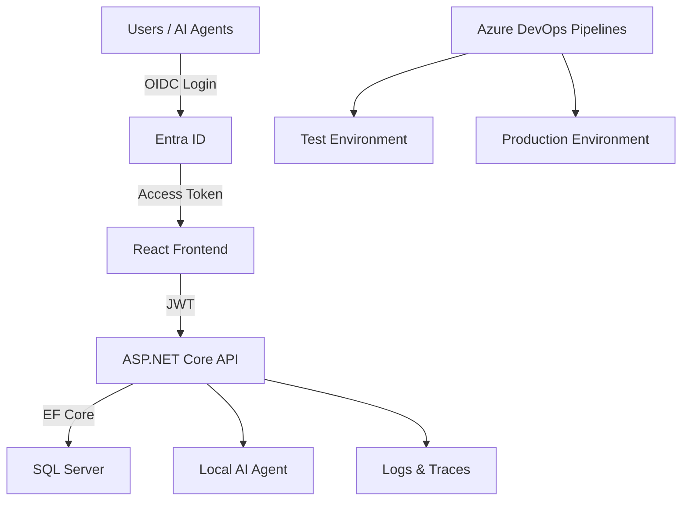

# Full Stack System Specification (v6)

**Author:** Michael Bender  
**Stack:** Microsoft Full Stack (React + TypeScript, .NET 8, EF Core, SQL Server, Azure DevOps, IIS / Azure App Service, Containers, Local AI)  
**Date:** January 2026

---

## 1. Vision Statement
Create a fully integrated Microsoft-based application platform for internal business systems, enabling rapid deployment, maintainability, and AI-assisted automation. The solution will modernize legacy applications into secure, web-based applications hosted on Windows Server using IIS, backed by CI/CD pipelines in Azure DevOps and enhanced by a local AI agent. Containerization is supported, but treated as an optimization step (not a prerequisite) to avoid unnecessary complexity early.

---

## 2. System Overview
### Core Components
| Layer | Technology | Purpose |
|--------|-------------|----------|
| **Frontend** | **React + TypeScript (Vite or Next.js)** | Decoupled web UI consuming backend APIs. Optimized for reuse, modern UX, and AI-driven UI patterns. |
| **Backend API** | **ASP.NET Core REST API (Minimal APIs or Controllers)** | Stable HTTP API contract to keep the UI replaceable. |
| **Database** | **SQL Server 2022** | Centralized, relational data store. |
| **ORM** | **Entity Framework Core 8** | Data access and migration management. |
| **Auth** | **Microsoft Entra ID (Azure AD, OIDC/OAuth2)** | Central identity provider for users, service principals, and AI agents. |
| **Web Server** | **IIS on Windows Server 2022** | Hosting environment for apps and APIs (containers optional). |
| **DevOps** | **Azure DevOps Pipelines + Repos** | Source control, build, deploy on merge to main/test. |
| **Observability** | **Serilog + OpenTelemetry (recommended)** | Structured logs and traces to enable rapid debugging and AI-assisted triage. |
| **AI Layer** | **Local Llama Model (via Ollama / LM Studio)** | Embedded AI assistant for code, testing, and operations. |
| **Containers (Optional)** | **Docker + Compose (Windows containers)** | Standardized app environments and portability (adopt after the baseline is stable). |

### Architectural Principles (Non-Goals: avoid unnecessary complexity)
- **API-first:** Business rules and authorization live in the REST API so the frontend remains replaceable.
- **Identity-first:** Authentication handled by Entra ID; credentials and MFA are externalized.
- **Monolith-first:** The platform uses a modular monolith approach; microservices and distributed systems are explicitly deferred until organizational scale or operational requirements justify the added complexity.
- **Minimum viable platform:** Standardize templates, logging, and CI/CD before adding containers, service meshes, or complex orchestration.
- **Authorization owned by the app:** Business roles and permissions are managed internally, not via AD groups.

---

## 3. Architecture Diagram

---

## 4. Security Model

### Authentication
- **Provider:** Windows Integrated Authentication (Negotiate/Kerberos)
- **Protocol:** NTLM/Kerberos (transparent SSO for domain-joined clients)
- **Environment:** Intranet-only; domain-joined Windows clients with Microsoft Authenticator 2FA
- **Clients:**
  - React frontend (hosted on same IIS site, inherits Windows auth)
  - Backend API (validates Windows identity)
  - AI agent / automation (Windows service account for local operations; service principal for Azure DevOps)
- **Identity Validation:** Performed by IIS and ASP.NET Core authentication middleware
- **Primary Identifier:** Windows domain\username (e.g., `DOMAIN\jsmith`)
- **User Experience:** Same SSO experience as RDS, report servers, SQL Server databases

> **Note:** Windows Authentication provides transparent authentication for domain users. No login forms or OAuth flows are required. Users authenticate once to their Windows domain (with Authenticator 2FA) and gain automatic access to all intranet applications.

### Authorization (What can you do?)
- **Model:** Application-managed roles and permissions
- **Storage:** SQL Server (independent of Active Directory groups)
- **Enforcement:** Backend API only
- **Reason for app-managed authorization:** IT does not have ability to modify AD groups; application must manage its own access control.

- **AD groups are NOT used** for application authorization or business workflows
- Initial admin user(s) may be bootstrapped via configuration or manual SQL insert
- All role assignments, permissions, and approvals are managed within the application

### Local Development Authentication
- **Domain-joined developers:** Use IIS Express with Windows Authentication enabled for realistic testing
- **Bypass mode (optional):** Kestrel profile with authentication disabled for rapid iteration without domain dependency
- **Integration testing:** All real user acceptance testing occurs in Stacker_Test environment (deployed from `main` branch) with full Windows Authentication enabled

### AI Access Control
- **Azure DevOps integration:** AI agent authenticates via service principal for API access (create PRs, run pipelines, query work items)
- **Local file/log access:** AI runs under dedicated Windows service account with read-only permissions
- Explicit app permissions assigned via application authorization system (same as human users)
- Cannot bypass approval gates or authorization rules
- Dev/Test: developer-level permissions (create branches/PRs, run pipelines, access test data, write to test resources)
- Prod: read-only access to logs/metrics and health endpoints; no direct writes or config changes
- No secrets exposure; uses managed identities/Key Vault-backed configs only

### Audit & Accountability
- Unified identity logging for all actors using Windows domain\username (humans) and service account names (AI/automation).
- Structured logs include `action`, `resource`, `result`, `duration`, `userId`, `isAI`, `correlationId`.
- Correlation IDs propagate across API calls, jobs, and pipelines for end-to-end traceability.
- Azure DevOps audit trail ties PRs, pipeline runs, and deployments to the initiating identity (user or service principal).
- Critical data changes are captured via application audit logs or database auditing (with `userId` and `correlationId`).
- Retention aligns with compliance requirements; avoid logging secrets or sensitive payloads.
---

## 5. Out of Scope (Intentional Non-Goals)
The following are explicitly **not** in scope for this platform and are deferred pending clear operational or scale justification:

- **Kubernetes-first or container-native orchestration:** Containers are deployment tools, not architectural requirements; IIS on Windows Server is the production target.
- **Internet-facing or public-access architecture:** This is an intranet-only platform; no DMZ, zero-trust, or external API exposure is planned.
- **Autonomous or self-modifying AI:** AI proposes and executes actions within Dev/Test; changes to shared branches, infrastructure, and Production remain human-approved and fully audited.
- **AI access to secrets, credentials, or raw sensitive data:** AI receives sanitized logs, traces, source code, and runbooks only; connection strings and API keys remain protected outside the AI layer.
- **Event-driven microservices or service mesh:** Complexity reserved for later phases; initial messaging is handled via direct API calls and database events (if needed).

These non-goals reduce risk and operational overhead during the initial rollout phases.

---

## 6. Deployment Workflow
| Stage | Trigger | Action | Target |
|--------|----------|---------|---------|
| **Dev** | Local Build | Developer runs locally | Local IIS Express / Kestrel |
| **Build Validation (CI)** | On every commit/PR | Automated build, run all tests, verify quality gates before merge | Azure DevOps hosted agent |
| **Test** | Merge to `main` | Azure DevOps builds & deploys to Test | Test Server (IIS) |
| **Prod** | Approve deployment | Azure DevOps deploys after approval | Production Server (IIS) |

Each deployment includes:  
- Orginal work item from ADO linkage to the PR, Test, deployment etc
- Unit + Integration Tests (xUnit / MSTest)  
- Publish build artifacts (API + UI)  
- Deploy to IIS (Web Deploy / artifact copy + app pool recycle)  
- Structured logging + correlation IDs for triage  
- Log aggregation & notification (optional PowerShell / Teams integration)

### CI/CD Notes (YAML)
- CI/CD is defined using Azure DevOps **YAML pipelines** (build + deployment). The intent is repeatable deployments to Test/Prod with minimal manual steps.
- Recommendation: keep the API and UI build as separate jobs and deploy them as separate artifacts, even if hosted on the same server.
- Frontend and API are built and deployed as **separate artifacts**, even when hosted on the same IIS or App Service instance.

### 6.1. Database Migration Strategy

#### EF Core Migration Workflow
1. **Developers create migrations locally** using `dotnet ef migrations add <MigrationName>` when modifying the EF Core data model.
2. **Migrations are committed to source control** alongside code changes (`.cs` migration files in the `Migrations/` folder).
3. **CI/CD pipeline validates migrations** can be applied cleanly before deployment by running `dotnet ef migrations bundle --self-contained` and verifying the bundle builds successfully.

#### Deployment-Time Migration Application
1. **Test Environment:** Migrations are applied **automatically** during deployment via EF Core Migration Bundles (`efbundle.exe`). The deployment pipeline executes the bundle as part of the release process.
2. **Production Environment:** Migrations are **reviewed during PR approval** to assess risk (e.g., schema changes, data loss potential). The bundle is executed in the deployment pipeline **after** an approval gate and only after a pre-deployment database backup completes.
3. **Always take a database backup** before applying migrations in Production. Use SQL Server backup jobs or inline YAML steps to capture the backup and verify success before proceeding.

#### Rollback Procedures
| Scenario | Action |
|----------|--------|
| **Code rollback only (no schema changes)** | Redeploy previous IIS artifacts from Azure DevOps; database remains at current schema version. |
| **Schema change rollback (breaking change)** | Restore database from pre-deployment backup, then redeploy previous code version to match the restored schema. |
| **Failed migration (partial apply)** | **Stop deployment immediately.** Restore database from backup. Investigate migration failure offline before reattempting. Do not proceed to Production. |

#### Migration Reversibility (Down Migrations)
- EF Core generates both **Up** (apply) and **Down** (rollback) migrations by default. Maintain these in source control for local development reversibility.
- **Production rollback via Down migrations is risky** (data loss, incomplete rollback). Always prefer **database backup restoration** for Production rollbacks rather than running `Down()` methods.
- Down migrations are useful for local development iteration but should not be relied upon in Production scenarios.

### 6.2. Rollback Procedures

#### Pre-Deployment Preparation Checklist
Before deploying to Production, ensure the following are in place to enable rapid rollback if necessary:

- [ ] **Verify database backup completed successfully** (automated in pipeline; check backup completion status before proceeding).
- [ ] **Document current deployed version numbers** for API, UI, and database schema version (store in deployment notes or Azure DevOps release).
- [ ] **Ensure previous deployment artifacts are retained** in Azure DevOps (minimum 5 releases retained per retention policy).
- [ ] **Confirm health check endpoint** is operational and returns expected status before deployment begins.

#### Rollback Decision Matrix
| Issue Severity | Time to Detect | Action |
|----------------|----------------|--------|
| **Critical (application down, data loss, security breach)** | < 5 minutes | **Immediate rollback** to previous version. No investigation; restore service first. |
| **Major (feature broken, significant user impact)** | < 30 minutes | **Rollback if no quick fix available.** Attempt rapid fix only if root cause is obvious and fix can be deployed in < 15 minutes. |
| **Minor (cosmetic issue, non-critical bug)** | Any time | **Fix forward in next deployment.** Do not rollback; log issue and schedule fix in upcoming sprint. |

#### IIS Rollback Procedure
Follow these steps to rollback an IIS-hosted application to the previous deployment:

1. **Stop the affected IIS application pool** via IIS Manager or PowerShell: `Stop-WebAppPool -Name "AppPoolName"`.
2. **Restore previous deployment artifacts** from Azure DevOps release (download artifacts or trigger redeploy of previous release).
3. **Update web.config** if configuration values changed between versions (connection strings, app settings).
4. **Restart the IIS application pool**: `Start-WebAppPool -Name "AppPoolName"`.
5. **Verify health check endpoint** responds successfully (e.g., `https://appname/health` returns HTTP 200).
6. **If database schema changed:** Restore database from pre-deployment backup before restarting the application pool (see Database Migration Strategy rollback procedures).

#### Automated Rollback Capabilities
- **Azure DevOps redeploy:** Azure DevOps supports one-click redeploy of any previous release via the Releases UI. Navigate to the target environment, select a previous successful release, and click "Redeploy."

- **Database rollback approval:** Database rollbacks require manual approval due to data loss risk. Automated rollback scripts should **stop and alert** before restoring a database backup, requiring operator confirmation.

#### Post-Rollback Actions
After a rollback is executed, complete the following within the specified timeframes:

1. **Update incident log** with root cause summary, rollback timestamp, and impacted users (within 1 hour).
2. **Schedule post-mortem meeting** within 48 hours; include development, QA, and operations stakeholders.
3. **Create work item** to address the underlying issue that caused the rollback; prioritize based on severity.
4. **Review deployment process** for gaps in testing or approval gates that allowed the issue to reach Production.

---

## 7. Local AI Agent
### Goals
- Review C#, SQL, and React frontendcode for errors and improvements.
- Propose tests and data validations.
- Summarize helpdesk tickets and automate updates.

### Operational Outcomes
- **Reduced MTTR:** Faster root-cause analysis of build and deployment failures via correlation IDs and structured log summarization.
- **Accelerated debugging:** AI-assisted triage reduces manual log parsing and speeds handoff between developers and support.
- **Improved onboarding:** New developers can query the AI for project structure, recent changes, and common runbooks without blocking senior engineers.
- **Helpdesk workload reduction:** Ticket summarization and status automation reduce manual administrative overhead.

### Technical Architecture
| Component | Description |
|------------|--------------|
| **Ollama / LM Studio** | Runs Llama 3 locally with API access. |
| **AI Connector API** | .NET service connecting to local AI endpoint. |
| **Knowledge Base** | Uses vectorized project data, logs, code, no secrets. |
| **Usage Examples** | “Summarize last 10 commits”, “Review recent build logs for errors.” |

#### Knowledge Base Refresh Strategy
Vector embeddings are regenerated when code or documentation changes to ensure the AI agent has current information for code review and triage.

1. **Automatic regeneration** is triggered on merge to the `main` branch via an Azure DevOps pipeline task.
2. **Incremental updates** are used for performance: only files modified since the last embedding run are re-embedded (based on git diff).
3. **Initial embedding generation** takes 15-30 minutes for a full codebase; incremental updates complete in 2-5 minutes.

#### Information Sources
| Source | Update Frequency | Purpose |
|--------|------------------|---------|
| **Source code (C#, Javascript, SQL)** | On commit to main | Code review, pattern analysis, and answering "where is X implemented?" |
| **API contracts (OpenAPI/Swagger)** | On API schema changes | Contract understanding and breaking change detection |
| **Build/deploy logs (Azure DevOps)** | On pipeline completion | Failure triage and root cause analysis for CI/CD issues; full pipeline history from all branches |
| **Application logs/traces** | On commit to main | Runtime issue diagnosis, correlation ID-based debugging |
| **Runbooks/documentation** | On commit to main | Operational guidance, onboarding support, and procedural questions |

#### Storage and Indexing Approach
- **File-based embeddings:** JSON files stored locally on AI server at `C:\Stacker\knowledge-base` for fast query access.
- **Embedding model:** `nomic-embed-text` via Ollama (optimized for embedding generation, separate from main Llama 3 instance).
- **Separate collections:** Maintain distinct JSON structures for code artifacts vs. operational data (logs/traces/DevOps) to optimize query performance and relevance.
- **Retention policy:** Keep the last 90 days of logs and traces; retain all code and documentation from the `main` branch indefinitely (archive older branches as needed).
- **Backup strategy:** Embeddings and indexer scripts are committed to the repository under `tools/knowledge-base/`. Local embeddings at `C:\Stacker\knowledge-base` are backed up daily to the repository.

#### Performance Considerations
- Initial embedding generation for a new repository takes **15-30 minutes** depending on codebase size. Measured baseline: **40 seconds** for current codebase (10 source files, 10 docs, 2 log files, 20 pipeline runs = 372 total entries).
- Incremental updates (triggered by new commits to `main`) complete in **2-5 minutes** and run as part of the CI/CD pipeline after deployment completes. Measured baseline: **4 seconds** when no content has changed.
- Query performance is optimized by separating code embeddings from operational log embeddings (different query patterns and update frequencies).

#### Implementation Details
- **Indexing scripts:** PowerShell scripts in `tools/knowledge-base/indexer/` handle embedding generation for code, documentation, logs, and Azure DevOps data.
- **Query interface:** PowerShell script `Ask-StackerAI.ps1` in `tools/knowledge-base/query/` provides natural language query interface to the knowledge base.
- **Azure DevOps integration:** PAT-based authentication retrieves pipeline runs, build logs, test results, and work item linkages from all branches for comprehensive failure triage.

---
## 7.2. Performance and Monitoring Baseline

**Note:** Performance baselines should be established in Phase 1 (Core Infrastructure), not retroactively added later. Early baseline measurement enables accurate detection of regressions throughout the application lifecycle.

### Performance Targets
| Metric | Target | Measurement Method |
|--------|--------|-------------------|
| **API Response Time (p95)** | < 200ms | Application Insights / OpenTelemetry traces |
| **Page Load Time (React frontendServer)** | < 1.5s | Browser DevTools / Real User Monitoring (RUM) |
| **Database Query Time (p95)** | < 100ms | EF Core logging + SQL Server Query Store |
| **Memory Usage (API)** | < 512MB per instance | Performance counters / Container metrics (if applicable) |
| **Concurrent Users** | 100+ simultaneous | Load testing (JMeter or k6) |

### Baseline Establishment Process
1. **Measure performance during Phase 1** using synthetic load tests against the reference application in the Test environment.
2. **Record baseline metrics** in project documentation (e.g., Azure DevOps wiki or repository README). Include test conditions (load profile, data volume, infrastructure specs).
3. **Set up Azure DevOps dashboards** to track performance trends over time using Azure Boards widgets or custom Power BI reports.
4. **Configure alerts** to trigger when metrics degrade by 20% or more from the established baseline (e.g., p95 response time exceeds 240ms).

### Monitoring Implementation
- **Serilog with structured logging:** Instrument the application to emit structured logs containing performance metrics (request duration, query execution time, memory usage).
- **OpenTelemetry exporter:** Export traces and metrics to an OpenTelemetry collector for centralized aggregation and analysis.
- **Metric storage:** Store metrics in SQL Server (for integration with existing infrastructure) or a lightweight time-series database (e.g., InfluxDB if dedicated performance monitoring is required).
- **Dashboards (optional):** Create Grafana or Power BI dashboards for real-time visualization of performance trends. Grafana is recommended for operational monitoring; Power BI for executive reporting.

### Performance Regression Detection in CI/CD
To prevent performance degradation from reaching Production:

1. **Run automated load tests** in the Test environment as part of the deployment pipeline (before Production deployment).
2. **Compare test results** against the established baseline metrics (store baseline in Azure DevOps variable group or configuration file).
3. **Block deployment** if performance degrades by more than 30% compared to baseline (e.g., p95 response time exceeds 260ms). Require manual approval and investigation before proceeding.
4. **Log regression details** to Azure DevOps build summary for post-deployment review and trend analysis.

### Capacity Planning Triggers
- **Quarterly metric review:** Schedule a quarterly review of performance metrics with development and operations teams to assess trends and identify optimization opportunities.
- **Infrastructure upgrade planning:** Plan infrastructure upgrades (additional IIS servers, database scaling, memory increases) when metrics consistently exceed 70% of target thresholds (e.g., p95 response time consistently > 140ms).
- **Historical trend analysis:** Use historical performance data to predict scaling needs before user impact occurs (e.g., if response time increases 10% per quarter, plan upgrades proactively).

---

## 8. Testing Strategy

### Testing Levels
| Level | Coverage Target | Tools | Responsibility | Execution Frequency |
|-------|----------------|-------|----------------|---------------------|
| **Unit Tests** | 70% code coverage | xUnit / MSTest | Developer (write tests alongside feature code) | Every commit / local build |
| **Integration Tests** | 80% coverage of critical API paths | WebApplicationFactory + xUnit | Developer / QA | CI pipeline + pre-deployment |
| **E2E Tests** | Critical user workflows only | Playwright for React frontend| QA / Automation Engineer | Test environment before Prod deployment |

### API Contract Testing
API contract tests verify that REST API responses conform to the published OpenAPI specification, ensuring the React frontend and other consumers are not broken by backend changes.

**Implementation:**
- Use `WebApplicationFactory<TEntryPoint>` to spin up the API in-memory during integration tests.
- Validate response structure, status codes, and schema against the OpenAPI spec.
- Run contract tests in the CI pipeline **before** deployment artifacts are published.
- Fail the build if contract violations are detected (prevents breaking changes from reaching Test or Prod).

**Goal:** Prevent accidental breaking changes to API contracts that would impact React frontend dependencies or future API consumers.

### Test Data Management
To ensure reliable and repeatable testing without risking production data:

- **SQL Server Database Snapshots:** Use database snapshots or backup/restore for integration tests to start from a known-good state.
- **Separate Test Database per Environment:** Maintain dedicated test databases for Dev, Test, and CI environments; never share databases across environments.
- **No Production Data in Tests:** Integration and E2E tests must **never** run against Production databases. Use anonymized or synthetic data for test environments.
- **Data Seeding:** Use EF Core migrations or seed scripts to populate test databases with predictable data sets for repeatable test execution.

---

## 9. Roadmap (Implementation Plan)
| Phase | Goal | Key Deliverables |
|--------|------|------------------|
| **Phase 1** | Core Infrastructure + AI Foundation | IIS hosting, Windows Auth, API-first templates, YAML CI/CD, baseline structured logging; install Ollama/LM Studio, basic .NET AI connector; initialize knowledge base (repo, README, early runbooks) |
| **Phase 2** | First App Migration (AI-assisted) | Migrate first legacy app → React frontend + REST API + EF Core + SQL; AI reviews PRs, proposes tests, documents patterns; CI/CD and build logs feed knowledge base |
| **Phase 3** | Monitoring & Enhancements | Central logging/tracing, backups, comprehensive runbooks; correlation IDs end-to-end; decision trees for triage; approval gates instrumentation |
| **Phase 4+** | Expansion & Autonomy | Scale to additional apps; automate work items, health checks, draft communications; define AI approval gates (PRs, deployments, customer comms); audit logging for all actions |

---

## 10. Training Roadmap (Free Hands-On Tutorials)
### 1. **React + TypeScript**
- [Microsoft Learn: Build JavaScript applications with React](https://learn.microsoft.com/en-us/training/paths/build-javascript-applications-react/)
- [Microsoft Learn: Take your first steps with TypeScript](https://learn.microsoft.com/en-us/training/paths/build-javascript-applications-typescript/)
- [YouTube (Microsoft Developer): React + TypeScript videos](https://www.youtube.com/@MicrosoftDeveloper/search?query=react%20typescript)

### 2. **ASP.NET Core Web API**
- [Microsoft Learn: Create a web API with ASP.NET Core](https://learn.microsoft.com/en-us/training/modules/build-web-api-aspnet-core/)
- [Microsoft Docs: ASP.NET Core Web API](https://learn.microsoft.com/en-us/aspnet/core/web-api/?view=aspnetcore-8.0)
- [YouTube (.NET): ASP.NET Core Web API videos](https://www.youtube.com/@dotnet/search?query=asp.net%20core%20web%20api)

### 3. **EF Core + SQL Server**
- [Microsoft Learn: Work with data in EF Core](https://learn.microsoft.com/en-us/training/modules/persist-data-ef-core/)
- [Microsoft Docs: Entity Framework Core](https://learn.microsoft.com/en-us/ef/core/)
- [Microsoft Docs: SQL Server](https://learn.microsoft.com/en-us/sql/sql-server/?view=sql-server-ver16)

### 4. **Testing (xUnit + Playwright)**
- [Microsoft Docs: Unit testing C# with dotnet test](https://learn.microsoft.com/en-us/dotnet/core/testing/unit-testing-with-dotnet-test)
- [Microsoft Docs: Integration tests in ASP.NET Core](https://learn.microsoft.com/en-us/aspnet/core/test/integration-tests?view=aspnetcore-8.0)
- [Playwright Docs: Getting started](https://playwright.dev/docs/intro)

### 5. **Azure DevOps Pipelines + CI/CD**
- [Microsoft Learn: Build applications with Azure DevOps](https://learn.microsoft.com/en-us/training/paths/build-applications-with-azure-devops/)
- [Microsoft Docs: Azure Pipelines](https://learn.microsoft.com/en-us/azure/devops/pipelines/?view=azure-devops)
- [YouTube (Microsoft DevOps): Azure Pipelines videos](https://www.youtube.com/@MicrosoftDevOps/search?query=azure%20pipelines)

### 6. **Hosting (IIS / Windows Server)**
- [Microsoft Docs: Host ASP.NET Core on Windows with IIS](https://learn.microsoft.com/en-us/aspnet/core/host-and-deploy/iis/?view=aspnetcore-8.0)
- [Microsoft Docs: ASP.NET Core Module (ANCM) for IIS](https://learn.microsoft.com/en-us/aspnet/core/host-and-deploy/aspnet-core-module?view=aspnetcore-8.0)

### 7. **Containers (Optional)**
- [Microsoft Learn: Introduction to Docker containers](https://learn.microsoft.com/en-us/training/modules/intro-to-docker-containers/)
- [Microsoft Docs: Containerize a .NET app](https://learn.microsoft.com/en-us/dotnet/core/docker/build-container)

### 8. **Identity (Entra ID / OIDC/OAuth2)**
- [Microsoft Docs: Microsoft identity platform](https://learn.microsoft.com/en-us/entra/identity-platform/)
- [Microsoft Docs: Authentication and authorization in ASP.NET Core](https://learn.microsoft.com/en-us/aspnet/core/security/authentication/?view=aspnetcore-8.0)

### 9. **Observability (Logging / Tracing)**
- [Microsoft Learn: Monitor and troubleshoot apps with Application Insights](https://learn.microsoft.com/en-us/training/modules/monitor-app-performance/)
- [OpenTelemetry Docs: .NET](https://opentelemetry.io/docs/languages/net/)

### 10. **AI Integration (Local LLMs)**
- [Ollama: Download](https://ollama.ai/download)
- [Ollama (GitHub)](https://github.com/ollama/ollama)
- [YouTube: Ollama videos](https://www.youtube.com/results?search_query=ollama+local+llm)

---

## 11. Implementation Checklist
### Phase 1 — Core Infrastructure + AI Foundation
- [X] Create Azure DevOps repo + YAML pipeline templates (build + deploy)
- [X] Setup branch policy (dev/test/main + approval gates)
- [X] Configure IIS + ASP.NET Core Hosting Bundle
- [X] Build CI/CD pipeline for application framework to confirm IIS and and ASP.net core setup
- [X] Enable Windows Integrated Auth (Negotiate) for UI + API
- [X] Add structured logging + correlation IDs (Serilog recommended)
- [X] Add health checks and a basic status endpoint
- [X] Install Ollama/LM Studio and validate local model serving
- [X] Integrate local AI agent (Dev/Test developer-level access; PRs and pipelines; Prod read-only logs/metrics; no secrets)
- [X] Create runbooks v1 (deploy, rollback, incident response) and store in repo
- [X] **Initialize AI knowledge base (index repo/README/runbooks + ingest DevOps logs)**
  - [X] **1. Setup: Knowledge Base Architecture**
    - [X] Create knowledge base directory structure (`tools/knowledge-base/embeddings/`, `indexer/`, `query/`)
    - [X] Download and configure `nomic-embed-text` model via Ollama (`ollama pull nomic-embed-text`)
    - [X] Create `tools/knowledge-base/config.json` for embedding settings and storage paths
    - [X] Document storage location: `C:\Stacker\knowledge-base` (local to AI server) with repository backup at `tools/knowledge-base/`
    - [X] Add "AI Knowledge Base Setup" section to `ops/runbooks/setup-runbook.md` with installation and configuration steps
  - [X] **2. Shared Embedding Utilities**
    - [X] Create PowerShell module: `tools/knowledge-base/indexer/EmbeddingHelpers.psm1`
    - [X] Implement `Get-Embedding` function: accepts text, returns embedding vector via `nomic-embed-text`
    - [X] Implement `Save-EmbeddingStore` / `Get-EmbeddingStore` functions: stores embeddings with metadata (file path, content hash, timestamp) to JSON
    - [X] Implement `Get-ContentHash` function: generates SHA256 hash for change detection (skip unchanged files)
    - [X] Implement `Split-TextIntoChunks` function: breaks large files into overlapping chunks for embedding
    - [X] Implement `Get-CosineSimilarity` / `Search-EmbeddingStore` functions: vector similarity search for queries
    - [X] Test: Verify embedding generation, storage, chunking, and similarity scoring work correctly
  - [X] **3. Content Indexing: Source Code**
    - [X] Create PowerShell script: `tools/knowledge-base/indexer/Index-SourceCode.ps1`
    - [X] Import `EmbeddingHelpers.psm1` for shared embedding functions
    - [X] Index all `.cs`, `.csproj`, `.json` files in `src/` directory
    - [X] Store embeddings with metadata (file path, last modified date, content hash)
    - [X] Support incremental mode: skip files with unchanged content hash
    - [X] Test: Verify embeddings generated for all expected source files; verify incremental skip works
  - [X] **4. Content Indexing: Documentation**
    - [X] Create PowerShell script: `tools/knowledge-base/indexer/Index-Documentation.ps1`
    - [X] Import `EmbeddingHelpers.psm1` for shared embedding functions
    - [X] Index `README.md`, all files in `docs/`, and `ops/runbooks/` directories
    - [X] Generate embeddings with metadata (document type, section headers, last updated)
    - [X] Support incremental mode: skip files with unchanged content hash
    - [X] Test: Verify documentation embeddings include section-level granularity
  - [X] **5. Content Indexing: Application Logs**
    - [X] Create PowerShell script: `tools/knowledge-base/indexer/Index-ApplicationLogs.ps1`
    - [X] Import `EmbeddingHelpers.psm1` for shared embedding functions
    - [X] Index structured Serilog logs from `src/Stacker-api/logs/Stacker-*.log`
    - [X] Extract: correlation IDs, timestamps, log levels, exception details
    - [X] Retention: Last 90 days of logs only; auto-purge older embeddings
    - [X] Test: Verify log parsing extracts all required metadata fields
  - [X] **6. Azure DevOps Integration: Pipeline Data Ingestion**
    - [X] Create Azure DevOps Personal Access Token (PAT) with Build (Read), Release (Read), Code (Read) scopes
    - [X] Store PAT securely in environment variable or Azure Key Vault reference
    - [X] Create PowerShell script: `tools/knowledge-base/indexer/Fetch-DevOpsData.ps1`
    - [X] Fetch pipeline runs from all branches (main, dev, test)
    - [X] Parse: Build errors, test failures, deployment outcomes, work item linkages
    - [X] Store: Structured JSON with correlation to commits, PRs, and work items
    - [X] Test: Verify script retrieves pipeline runs and parses all expected fields
  - [X] **7. Query Interface: Search and RAG**
    - [X] Create PowerShell script: `tools/knowledge-base/query/Search-KnowledgeBase.ps1`
    - [X] Implement: Convert natural language query to embedding, search local embeddings, return top 5 matches
    - [X] Output: File paths, relevant snippets, metadata (last modified, document type)
    - [X] Create Ollama RAG prompt template: `tools/knowledge-base/query/rag-prompt-template.txt`
    - [X] Template structure: [Context from KB] + [User question] + [Instructions for response format]
    - [X] Create PowerShell script: `tools/knowledge-base/query/Ask-StackerAI.ps1`
    - [X] Flow: User question → Search KB → Pass context + question to Ollama → Return answer
    - [X] Log all queries with timestamps, correlation IDs, and user identity (audit trail)
    - [X] Test queries: "What endpoints use Windows Auth?", "Show recent API errors", "How to deploy to Test?"
    - [X] Test end-to-end: "How do I check if Ollama is healthy?" (expect references to `OllamaClient.IsHealthyAsync` and `/api/ai/health`)
  - [X] **8. CI/CD Integration: Automated Knowledge Base Updates**
    - [X] Add Azure DevOps YAML pipeline task to trigger knowledge base rebuild on merge to `main`
    - [X] Task executes: `Index-SourceCode.ps1`, `Index-Documentation.ps1`, `Fetch-DevOpsData.ps1` in sequence
    - [X] Verify: Pipeline task completes in < 5 minutes (incremental update performance target)
    - [X] Configure: Pipeline failure notifications if indexing fails
    - [X] Create operational runbook: `ops/runbooks/ai-knowledge-base-maintenance.md`
    - [X] Document: How to rebuild index, update embeddings, verify data freshness, retention policies
  - [X] **9. Validation: Knowledge Base Smoke Tests**
    - [X] Run initial full indexing on entire repository (expect 15-30 minutes)
    - [X] Verify: Embeddings exist for all source files, documentation, and recent logs
    - [X] Perform smoke tests with sample queries from different categories (code, docs, logs, DevOps)
    - [X] Validate: Response quality and relevance meet acceptable thresholds
    - [X] Document: Any gaps or missing information in knowledge base
    - [X] Measure: Indexing performance baselines (full repo: 15-30 min, incremental: 2-5 min)

### Phase 2 — First App Migration (AI-assisted)
- [ ] Create reference app: React frontend + REST API + EF Core + SQL
- [ ] Add Build Validation (CI) pipeline: build + tests + quality gates on PRs
- [ ] Document AI feedback workflow

### Phase 3 — Monitoring & Enhancements
- [ ] Centralize logs/traces for debugging and AI triage
- [ ] Implement automated backups + retention policy (Test/Prod)
- [ ] Expand runbooks and add decision trees for common incidents

### Phase 4+ — Expansion & Autonomy
- [ ] Automate recurring work (work items, health checks, draft communications) with full audit logging

---

**End of Document**

